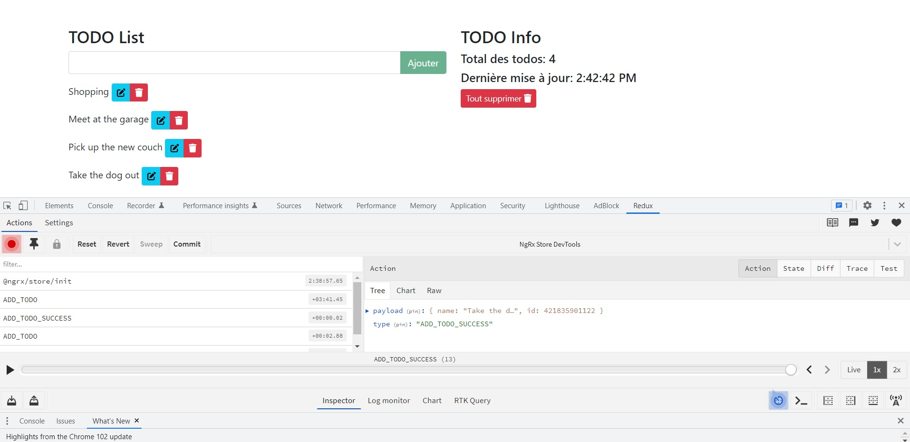

# Ngrx Todo Project

This project was generated with [Angular CLI](https://github.com/angular/angular-cli) version 13.3.3.



## Technologies


This is a small project for the practical application of Ngrx.
Seen in this project :
* action
* effect
* index
* module
* reducer
* selectors
* state

## Development server

1 - Clone or Fork the project :
[Clone a repo](https://docs.github.com/en/repositories/creating-and-managing-repositories/cloning-a-repository) /
[Forke a repo](https://docs.github.com/en/get-started/quickstart/fork-a-repo)

2 Run dev server :
```
ng serve
``` 
Navigate to `http://localhost:4200/`. The application will automatically reload if you change any of the source files.

3 Install all depencencies :
```
npm install
```
To make sur you everything work correctly.

4 Don't forget to execute the Fake Rest API :
```
npm run db
```
Se package.json for more informations.
